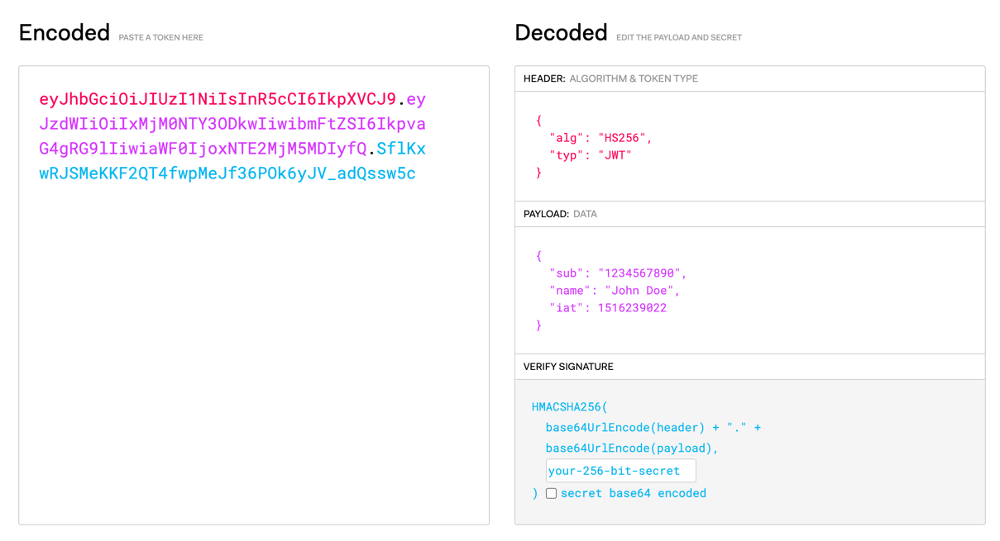
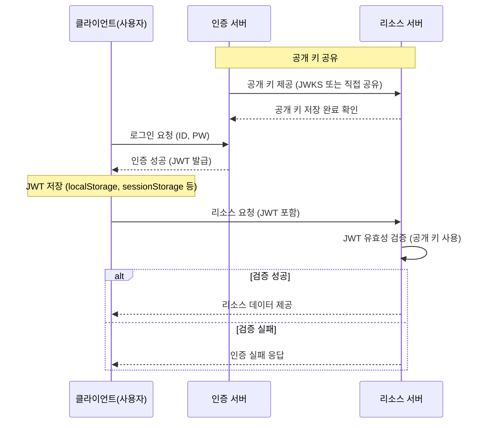

# JWT 인증 서버 구현
현재 제가 회사에서 맡고 있는 프로젝트에는 모두 세션 방식을 통한 사용자 인증 및 인가를 처리하고 있습니다.
이에 세션 방식과 더불어 자주 사용되는 JWT 방식은 어떻게 인증 및 인가를 처리하는지 궁금했습니다.

---

## JWT(Json Web Token)
- JWT는 JSON 포맷을 사용한 토큰 기반 인증 방식으로, 클라이언트와 서버 간에 보안 정보(사용자 인증 정보, 역할 등)를 간단하고, 안전하게 교환하기 위해 사용됩니다.

 

### JWT 의 특징
- **Stateless 구조**: 인증 정보를 클라이언트가 보관하며 서버의 상태를 유지할 필요 없습니다.
- **Cross-domain 지원**: 여러 도메인 간 인증 정보가 공유 가능합니다.

 

### JWT 구성 요소

1. **Header**
    - 토큰의 타입(JWT)과 알고리즘(예: HMAC SHA256 또는 RSA)을 정의합니다.
2. **Payload**
    - 토큰에 포함된 정보(클레임)으로, 사용자 데이터(ID, 권한 등)와 토큰의 만료 시간(exp), 발급자(iss) 등을 포함합니다.
3. **Signature**
    - Header와 Payload를 비밀 키로 서명한 값으로, 토큰의 위변조 여부를 확인하기 위해 사용됩니다.
        - 비밀 키는 인증 서버에서만 보관함으로서 다른 서버에서는 JWT 토큰을 발급할 수 없고 제공받은 공개 키를 통해 인증만 가능

 

### JWT 인증 흐름

#### 인증 서버 (JWT 발급 서버)
- 사용자 로그인 정보를 처리하여 사용자 인증을 수행하고, 인증이 성공할 경우 JWT를 생성하여 반환(발급s)합니다.
- JWT 생성 시 비밀 키(Private Key)를 사용해 서명하며, 리소스 서버에서 검증할 수 있도록 공개 키(Public Key)를 제공합니다.

#### 리소스 서버
- 클라이언트가 제공한 JWT를 검증하여 요청된 자원에 접근 권한이 있는지 확인합니다. 조건을 충족할 경우 요청 자원을 제공합니다.

 

### JWT 의 장점
1. **상태 비저장 구조**
   - JWT 토큰 자체에 사용자 정보를 담고 있어 별도의 서버 저장소가 필요하지 않습니다.
     - 서버가 상태를 관리하지 않으므로 확장성(Scalability)에 용이합니다.
2. **다양한 환경에서 사용 가능**
   - JSON은 언어나 플랫폼에 독립적이므로, 모바일, 웹, IoT 등 모든 환경에서 JWT를 활용할 수 있습니다.
3. **사용 간편성**
   - 클라이언트는 요청마다 JWT를 포함하기만 하면 되며, 인증 상태를 항상 유지할 필요가 없습니다.

 

### JWT 의 단점
1. **토큰 크기 증가**
   - JWT는 헤더와 페이로드 모두 `Base64Url`로 인코딩되므로, 데이터 크기가 커질 수 있습니다.
     - 요청 때마다 JWT를 포함하여 요청하므로 대량의 클레임이 포함되면 네트워크 비용이 증가합니다.
2. **토큰 취소 어려움 (Stateless 특성)**
   - 발급된 JWT는 보통 서버에서 상태를 저장하지 않으므로, 발급 이후에는 명시적으로 취소하기 어렵습니다.
     - 별도의 블랙리스트(Blacklist)를 사용하거나 짧은 토큰 수명을 설정해야 합니다.
3.  **보안 취약점 관리 필요**
   - `localStorage`나 `sessionStorage`에 저장된 경우, XSS(크로스 사이트 스크립팅) 공격에 취약할 수 있습니다.
     - HTTPS를 사용하지 않을 경우, 토큰이 탈취될 위험이 있습니다.

---

## 마치며
JWT는 세션 방식에 비해 효율적이고 확장성 높은 인증 방식을 제공하지만 토큰 자체가 클라이언트에서 보관하기 때문에 보안을 세심히 관리해야 합니다.
때문에 서비스의 보안 요구사항이나 확장성 등 아키텍처 특성을 고려해서 사용해야 할 것입니다.
